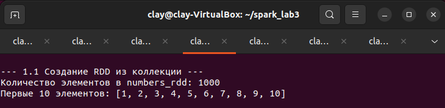
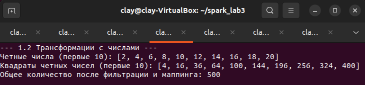
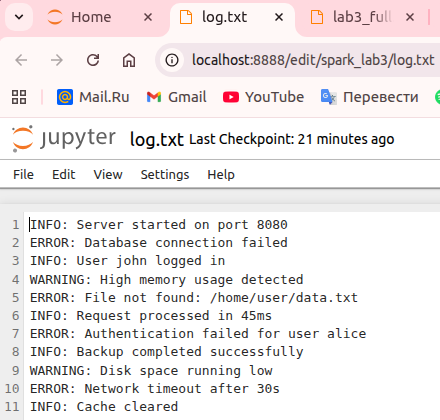
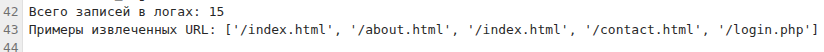
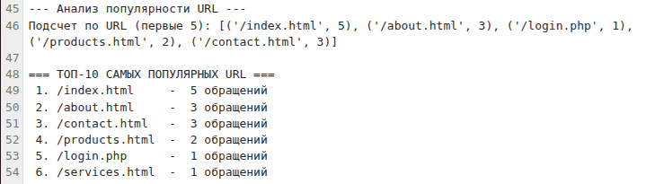
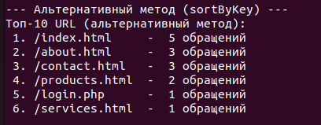
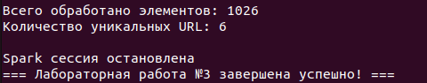
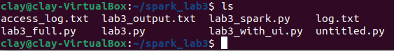

# Лабораторная работа №3: Работа с RDD в Apache Spark

## Цель работы
Освоить базовые принципы работы с низкоуровневой абстракцией Apache Spark — **RDD (Resilient Distributed Dataset)**.  
Получить практические навыки создания RDD, применения основных трансформаций (**transformations**) и действий (**actions**), а также построения и выполнения последовательностей операций (**DAG**).

---

## Стек технологий

- **Платформа/ОС:** Linux (Ubuntu)  
- **Фреймворк:** Apache Spark 3.5.0  
- **Язык программирования:** Python (PySpark)  
- **Инструментарий:** Spark Standalone Mode  
- **Данные:** Логи веб-сервера, текстовые данные

---

## Теоретическая часть

### RDD (Resilient Distributed Dataset)

RDD — это неизменяемая, отказоустойчивая коллекция объектов, распределённая между узлами кластера, которыми можно манипулировать параллельно.

**Resilient (Устойчивый):** способность восстанавливаться после сбоев благодаря *lineage* (цепочке происхождения)  
**Distributed (Распределённый):** данные разделены на партиции (*partitions*) и обрабатываются на разных узлах кластера  
**Dataset (Набор данных):** представляет собой набор объектов

---

### Операции над RDD

- **Трансформации (Transformations):** "ленивые" операции, создающие новое RDD из существующего  
- **Действия (Actions):** операции, которые запускают вычисления и возвращают результат

---

## Практическая реализация

### Часть 1. Базовые операции с RDD

#### 1.1 Создание RDD из коллекции

```python
numbers_rdd = sc.parallelize(range(1, 1001))
print(f"Количество элементов: {numbers_rdd.count()}")
print(f"Первые 10 элементов: {numbers_rdd.take(10)}")
```

**Результат:**
```
Количество элементов в numbers_rdd: 1000
Первые 10 элементов: [1, 2, 3, 4, 5, 6, 7, 8, 9, 10]
```



📷 *[СКРИНШОТ 1: Создание RDD из коллекции — вывод результатов]*


---

#### 1.2 Применение трансформаций к числам

```python
even_numbers = numbers_rdd.filter(lambda x: x % 2 == 0)
squared_numbers = even_numbers.map(lambda x: x ** 2)
result_numbers = numbers_rdd.filter(lambda x: x % 2 == 0).map(lambda x: x ** 2)
```

**Результат:**
```
Четные числа (первые 10): [2, 4, 6, 8, 10, 12, 14, 16, 18, 20]
Квадраты четных чисел (первые 10): [4, 16, 36, 64, 100, 144, 196, 256, 324, 400]
Общее количество после фильтрации и маппинга: 500
```



📷 *[СКРИНШОТ 2: Трансформации с числами — фильтрация и маппинг]*

---

#### 1.3 Создание RDD из текстового файла

**Тестовые данные (`log.txt`):**
```text
INFO: Server started on port 8080
ERROR: Database connection failed
INFO: User john logged in
WARNING: High memory usage detected
ERROR: File not found: /home/user/data.txt
INFO: Request processed in 45ms
ERROR: Authentication failed for user alice
INFO: Backup completed successfully
WARNING: Disk space running low
ERROR: Network timeout after 30s
INFO: Cache cleared
```

```python
log_rdd = sc.textFile("file:///home/clay/spark_lab3/log.txt")
```

**Результат:**
```
Общее количество строк в логах: 11
Первые 5 строк логов:
['INFO: Server started on port 8080',
 'ERROR: Database connection failed',
 'INFO: User john logged in',
 'WARNING: High memory usage detected',
 'ERROR: File not found: /home/user/data.txt']
```



📷 *[СКРИНШОТ 3: Создание RDD из файла и вывод логов]*

---

#### 1.4 Применение трансформаций к логам

```python
upper_logs = log_rdd.map(lambda line: line.upper())
error_logs = log_rdd.filter(lambda line: "ERROR" in line.upper())
```

**Результат:**
```
Логи в верхнем регистре (первые 5):
['INFO: SERVER STARTED ON PORT 8080',
 'ERROR: DATABASE CONNECTION FAILED',
 'INFO: USER JOHN LOGGED IN',
 'WARNING: HIGH MEMORY USAGE DETECTED',
 'ERROR: FILE NOT FOUND: /HOME/USER/DATA.TXT']

Строки с ERROR (все):
['ERROR: Database connection failed',
 'ERROR: File not found: /home/user/data.txt',
 'ERROR: Authentication failed for user alice',
 'ERROR: Network timeout after 30s']

Количество ошибок: 4
```


📷 *[СКРИНШОТ 4: Трансформации с логами — маппинг и фильтрация]*

---

### Часть 2. Анализ логов веб-сервера

**Тестовые данные (`access_log.txt`):**
```text
127.0.0.1 - - [01/Jan/2023:00:00:01 +0000] "GET /index.html HTTP/1.0" 200 1234
127.0.0.1 - - [01/Jan/2023:00:00:02 +0000] "GET /about.html HTTP/1.0" 200 2345
127.0.0.1 - - [01/Jan/2023:00:00:03 +0000] "GET /index.html HTTP/1.0" 200 1234
...
```

#### Реализация анализа

```python
def extract_url(line):
    try:
        parts = line.split()
        if len(parts) > 6:
            return parts[6]
        else:
            return None
    except:
        return None

# Основной пайплайн обработки
url_counts = (web_log_rdd
             .map(extract_url)
             .filter(lambda x: x is not None)
             .map(lambda url: (url, 1))
             .reduceByKey(lambda a, b: a + b))

top_urls = url_counts.sortBy(lambda x: x[1], ascending=False)
```

**Результат:**
```
Всего записей в логах: 15
Примеры извлеченных URL: ['/index.html', '/about.html', '/index.html', '/contact.html', '/login.php']
```



📷 *[СКРИНШОТ 5: Анализ логов — извлечение URL и подсчет]*

---

### Топ-10 самых популярных URL

```text
=== ТОП-10 САМЫХ ПОПУЛЯРНЫХ URL ===
 1. /index.html     -  5 обращений
 2. /about.html     -  3 обращений
 3. /contact.html   -  3 обращений
 4. /products.html  -  2 обращений
 5. /login.php      -  1 обращений
 6. /services.html  -  1 обращений
```




📷 *[СКРИНШОТ 6: Финальный результат — топ-10 URL]*
---

### Альтернативная реализация

```python
top_urls_alt = (urls_rdd
               .map(lambda url: (url, 1))
               .reduceByKey(lambda a, b: a + b)
               .map(lambda x: (x[1], x[0]))
               .sortByKey(ascending=False)
               .map(lambda x: (x[1], x[0])))
```



📷 *[СКРИНШОТ 7: Альтернативная реализация с sortByKey]*

---

### Статистика выполнения

```
Всего обработано элементов: 1026
Количество уникальных URL: 6
```



📷 *[СКРИНШОТ 8: Общая статистика выполнения]*


📷 *[Spark UI]*

---

---

## Структура проекта

 

📷 *[СКРИНШОТ 10: Файлы проекта лабораторной работы]*

**Содержимое директории:**
```text
lab3_full.py          # Полная реализация лабораторной работы
lab3_with_ui.py       # Версия с задержкой для Web UI
log.txt               # Тестовые логи приложения
access_log.txt        # Веб-логи в Common Log Format
lab3_output.txt       # Полный вывод выполнения
```

---

## Ответы на теоретические вопросы

### 1. Чем трансформация отличается от действия в Spark?

**Трансформации** — "ленивые" операции, создающие новые RDD, но не выполняющиеся сразу. Они формируют план вычислений (DAG).  
**Действия** — операции, запускающие выполнение и возвращающие результат в драйвер или во внешнее хранилище.

| Аспект | Трансформации | Действия |
|:--|:--|:--|
| Время выполнения | Отложенное (ленивое) | Немедленное |
| Результат | Новое RDD | Значение или сохранение |
| Запуск вычислений | Не запускают | Запускают все предыдущие трансформации |
| Примеры | `map()`, `filter()`, `reduceByKey()` | `count()`, `collect()`, `take()` |

**Пример:**
```python
# Трансформации (не выполняются сразу)
even_numbers = numbers_rdd.filter(lambda x: x % 2 == 0)
squared_numbers = even_numbers.map(lambda x: x ** 2)

# Действие (запускает выполнение)
result = squared_numbers.count()  # Запускает весь пайплайн
```

---

### 2. Как работает reduceByKey и почему он эффективнее groupByKey?

**reduceByKey** работает в два этапа:
1. Локальная агрегация на каждой партиции  
2. Глобальная агрегация после shuffle  

**groupByKey** — передает все значения через сеть без предварительной обработки.

**Преимущества reduceByKey:**
- Меньше сетевого трафика  
- Лучшая производительность  
- Меньше нагрузки на память

**Пример:**
```python
# Эффективно
url_counts = urls_rdd.map(lambda url: (url, 1)).reduceByKey(lambda a, b: a + b)

# Неэффективно
url_counts = urls_rdd.map(lambda url: (url, 1)).groupByKey().mapValues(len)
```

**Визуализация разницы:**
```text
reduceByKey: (url,1) + (url,1) → (url,2) [на маппере] → shuffle → (url,2)
groupByKey:  (url,1) + (url,1) → shuffle → [(url,1), (url,1)] → (url,2)
```

---

### 3. Почему RDD — низкоуровневая абстракция?

| Признак | RDD | DataFrame |
|:--|:--|:--|
| Схема | Отсутствует | Есть строгая схема |
| Оптимизация | Ручная | Автоматическая (Catalyst Optimizer) |
| Исполнение | Без Tungsten | С Tungsten engine |
| API | Низкоуровневый | Высокоуровневый |
| Производительность | Медленнее | Быстрее |

RDD требуют больше ручной работы и не используют оптимизации движка **Spark SQL**, поэтому считаются низкоуровневой абстракцией.
