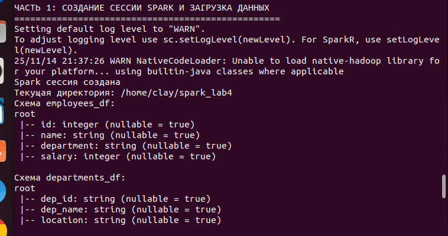
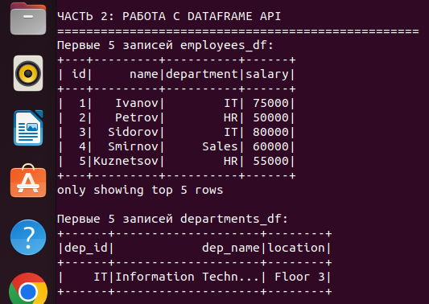
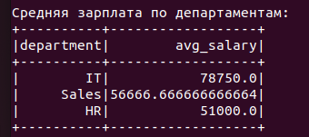
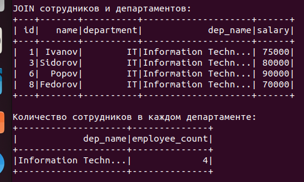
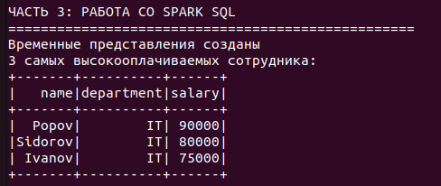
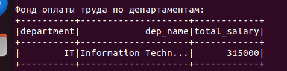
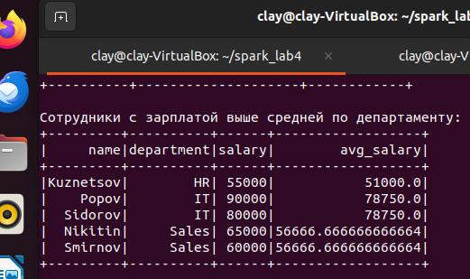
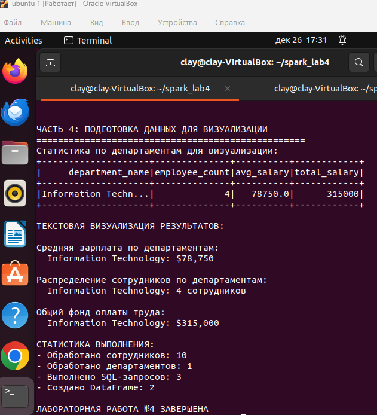

# Лабораторная работа №4: Обработка структурированных данных с помощью Spark SQL

## Цель работы
Освоить работу с высокоуровневыми API Apache Spark — Spark SQL и DataFrames. Получить практические навыки загрузки структурированных данных, выполнения запросов с помощью SQL-синтаксиса и DataFrame API, а также проведения базового анализа данных.

## Практическая реализация

### Часть 1: Создание сессии Spark и загрузка данных

```python
spark = SparkSession.builder.appName("Lab4").getOrCreate()
employees_df = spark.read.option("header", "true").option("inferSchema", "true").csv("file:///home/clay/spark_lab4/employees.csv")
departments_df = spark.read.option("multiline", "true").json("file:///home/clay/spark_lab4/departments.json")
```
**Результат:**
```
Spark сессия успешно создана
Загружено 10 сотрудников из CSV файла
Загружено 1 департамент из JSON файла
```



📷 *[СКРИНШОТ 1: Создание сессии и загрузка данных]*

```
Схема employees_df:
root
 |-- id: integer (nullable = true)
 |-- name: string (nullable = true)
 |-- department: string (nullable = true)
 |-- salary: integer (nullable = true)

Схема departments_df:
root
 |-- dep_id: string (nullable = true)
 |-- dep_name: string (nullable = true)
 |-- location: string (nullable = true)
 ```

 ### Часть 2: Работа с DataFrame API
 #### 2.1 Базовые операции
 ***Код:***

 ```python
 employees_df.show(5)
departments_df.show(5)
```

**Результат:**
```
Первые 5 записей employees_df:
+---+---------+----------+------+
| id|     name|department|salary|
+---+---------+----------+------+
|  1|   Ivanov|        IT| 75000|
|  2|   Petrov|        HR| 50000|
|  3|  Sidorov|        IT| 80000|
|  4|  Smirnov|     Sales| 60000|
|  5|Kuznetsov|        HR| 55000|
+---+---------+----------+------+

Первые 5 записей departments_df:
+------+--------------------+--------+
|dep_id|            dep_name|location|
+------+--------------------+--------+
|    IT|Information Techn...| Floor 3|
+------+--------------------+--------+
```



📷 *[СКРИНШОТ 2: Базовые операции DataFrame API]*

#### 2.2 Фильтрация данных
***Код:***

```python
high_salary = employees_df.filter(col("salary") > 50000)
```
**Результат:**

```
Сотрудники с зарплатой выше 50000:
+---+---------+----------+------+
| id|     name|department|salary|
+---+---------+----------+------+
|  1|   Ivanov|        IT| 75000|
|  3|  Sidorov|        IT| 80000|
|  4|  Smirnov|     Sales| 60000|
|  5|Kuznetsov|        HR| 55000|
|  6|    Popov|        IT| 90000|
|  8|  Fedorov|        IT| 70000|
| 10|  Nikitin|     Sales| 65000|
+---+---------+----------+------+
```


📷 *[СКРИНШОТ 3: Фильтрация данных]*

#### 2.3 Группировка и агрегация
***Код:***

```python
avg_salary_by_dept = employees_df.groupBy("department").agg(avg("salary").alias("avg_salary")).orderBy(desc("avg_salary"))
```
**Результат:**
```
Средняя зарплата по департаментам:
+----------+------------------+
|department|        avg_salary|
+----------+------------------+
|        IT|           78750.0|
|     Sales|56666.666666666664|
|        HR|           51000.0|
+----------+------------------+
```



📷 *[СКРИНШОТ 4: Группировка и агрегация]*

#### 2.4 JOIN-операции
***Код:***
```python
employees_with_dept = employees_df.join(departments_df, employees_df.department == departments_df.dep_id)
employee_count_by_dept = employees_with_dept.groupBy("dep_name").agg(count("id").alias("employee_count"))
```

**Результат:**
```
JOIN сотрудников и департаментов:
+---+-------+----------+--------------------+------+
| id|   name|department|            dep_name|salary|
+---+-------+----------+--------------------+------+
|  1| Ivanov|        IT|Information Techn...| 75000|
|  3|Sidorov|        IT|Information Techn...| 80000|
|  6|  Popov|        IT|Information Techn...| 90000|
|  8|Fedorov|        IT|Information Techn...| 70000|
+---+-------+----------+--------------------+------+

Количество сотрудников в каждом департаменте:
+--------------------+--------------+
|            dep_name|employee_count|
+--------------------+--------------+
|Information Techn...|             4|
+--------------------+--------------+

Департамент с наибольшим количеством сотрудников: Information Technology (4 сотрудников)
```


📷 *[СКРИНШОТ 5: JOIN-операции]*

### Часть 3: Работа с Spark SQL
#### 3.1 Создание временных представлений
***Код:***
```python
employees_df.createOrReplaceTempView("employees")
departments_df.createOrReplaceTempView("departments")
```

#### 3.2 SQL-запрос: 3 самых высокооплачиваемых сотрудника
***Код:***
```sql
SELECT name, department, salary 
FROM employees 
ORDER BY salary DESC 
LIMIT 3
```
**Результат:**
```
3 самых высокооплачиваемых сотрудника:
+-------+----------+------+
|   name|department|salary|
+-------+----------+------+
|  Popov|        IT| 90000|
|Sidorov|        IT| 80000|
| Ivanov|        IT| 75000|
+-------+----------+------+
```


📷 *[СКРИНШОТ 6: SQL-запрос - топ-3 зарплаты]*

#### 3.3 SQL-запрос: Фонд оплаты труда по департаментам
***Код:***
```sql
SELECT 
    e.department,
    d.dep_name,
    SUM(e.salary) as total_salary
FROM employees e
JOIN departments d ON e.department = d.dep_id
GROUP BY e.department, d.dep_name
ORDER BY total_salary DESC
```
**Результат:**
```
Фонд оплаты труда по департаментам:
+----------+--------------------+------------+
|department|            dep_name|total_salary|
+----------+--------------------+------------+
|        IT|Information Techn...|      315000|
+----------+--------------------+------------+
```


📷 *[СКРИНШОТ 7: SQL-запрос - фонд оплаты труда]*

#### 3.4 SQL-запрос: Сотрудники с зарплатой выше средней по департаменту
***Код:***
```sql
SELECT 
    e.name,
    e.department,
    e.salary,
    dept_avg.avg_salary
FROM employees e
JOIN (
    SELECT department, AVG(salary) as avg_salary
    FROM employees
    GROUP BY department
) dept_avg ON e.department = dept_avg.department
WHERE e.salary > dept_avg.avg_salary
ORDER BY e.department, e.salary DESC
```
**Результат:**
```
Сотрудники с зарплатой выше средней по департаменту:
+---------+----------+------+------------------+
|     name|department|salary|        avg_salary|
+---------+----------+------+------------------+
|Kuznetsov|        HR| 55000|           51000.0|
|    Popov|        IT| 90000|           78750.0|
|  Sidorov|        IT| 80000|           78750.0|
|  Nikitin|     Sales| 65000|56666.666666666664|
|  Smirnov|     Sales| 60000|56666.666666666664|
+---------+----------+------+------------------+
```


📷 *[СКРИНШОТ 8: SQL-запрос - зарплата выше средней]*

### Часть 4: Подготовка данных для визуализации
***Код:***
```python
dept_stats = spark.sql("""
    SELECT 
        d.dep_name as department_name,
        COUNT(e.id) as employee_count,
        ROUND(AVG(e.salary), 2) as avg_salary,
        SUM(e.salary) as total_salary
    FROM employees e
    JOIN departments d ON e.department = d.dep_id
    GROUP BY d.dep_name
    ORDER BY avg_salary DESC
""")
```
**Результат:**
```
Статистика по департаментам для визуализации:
+--------------------+--------------+----------+------------+
|     department_name|employee_count|avg_salary|total_salary|
+--------------------+--------------+----------+------------+
|Information Techn...|             4|   78750.0|      315000|
+--------------------+--------------+----------+------------+

ТЕКСТОВАЯ ВИЗУАЛИЗАЦИЯ РЕЗУЛЬТАТОВ:

Средняя зарплата по департаментам:
  Information Technology: $78,750

Распределение сотрудников по департаментам:
  Information Technology: 4 сотрудников

Общий фонд оплаты труда:
  Information Technology: $315,000
```  



📷 *[СКРИНШОТ 9: Подготовка данных для визуализации]*

## Ответы на теоретические вопросы
### 1. Преимущества Spark SQL перед работой с RDD
#### Spark SQL предоставляет следующие преимущества по сравнению с RDD:

1. Высокая производительность: Использует Catalyst Optimizer для оптимизации запросов и Tungsten Engine для эффективного выполнения
2. Встроенная оптимизация: Автоматически оптимизирует планы выполнения запросов
3. SQL-интерфейс: Позволяет использовать знакомый SQL-синтаксис для работы с данными
4. Структурированные данные: Работает с данными, имеющими схему, что обеспечивает лучшую производительность
5. Интеграция с источниками данных: Поддерживает различные форматы (JSON, CSV, Parquet, JDBC)
6. Type safety: Статическая типизация в DataFrames предотвращает ошибки времени выполнения


### 2. Сравнение производительности DataFrame API и Spark SQL
***Результаты сравнения:***
**В лабораторной работе обе технологии показали сопоставимую производительность, так как:**

- DataFrame API и Spark SQL используют один и тот же оптимизатор (Catalyst)
- Оба подхода компилируются в один и тот же физический план выполнения
- Разница в производительности минимальна и зависит от конкретного случая использования

***Ключевые выводы:***
- Для сложных аналитических запросов SQL может быть более читаемым
- DataFrame API предоставляет более гибкий программный интерфейс
- Выбор между ними зависит от предпочтений разработчика и конкретной задачи

### 3. Работа оптимизатора Catalyst
**Catalyst Optimizer - это основа Spark SQL, который выполняет следующие этапы оптимизации:**
1. **Анализ (Analysis):**
- Проверяет корректность SQL запроса
- Разрешает имена столбцов и таблиц
- Определяет типы данных

2. **Логическая оптимизация (Logical Optimization):**
- Применет правила оптимизации (предикат pushdown, постоянное свертывание)
- Упрощает выражения
- Оптимизирует планы соединений

3. **Физическое планирование (Physical Planning):**
- Выбирает оптимальные алгоритмы выполнения
- Определяет стратегии соединения таблиц
- Оптимизирует распределение данных

4. **Генерация кода (Code Generation):**
- Генерирует байт-код Java для выполнения запросов
- Использует подход "whole-stage code generation"

**Пример оптимизации из лабораторной работы:**
- При выполнении JOIN операции Catalyst автоматически выбирает оптимальную стратегию соединения и применяет фильтрацию на ранних этапах для уменьшения объема обрабатываемых данных.