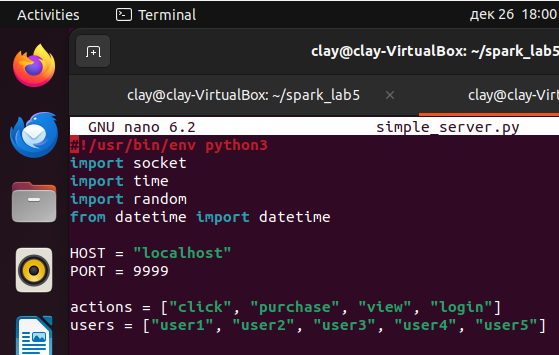
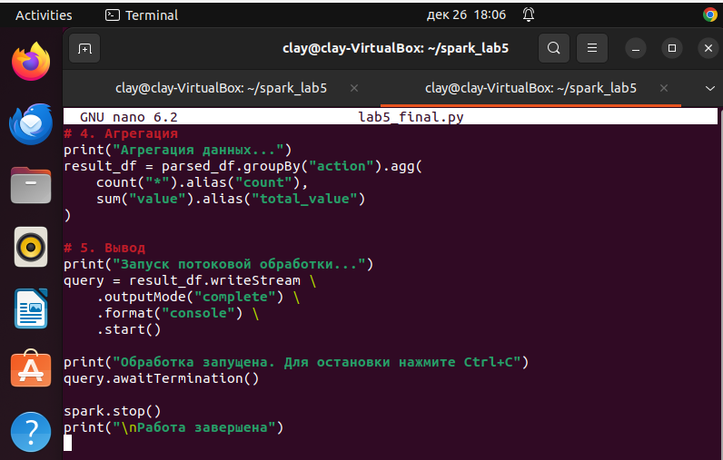

# Лабораторная работа №5: Потоковая обработка данных со Structured Streaming

## Цель работы
Освоить основы потоковой обработки данных с помощью Apache Spark Structured Streaming. Получить практические навыки чтения потоковых данных, выполнения скользящих агрегаций и визуализации результатов в реальном времени.

## Практическая реализация

### Часть 1: Настройка потока данных через Socket
***Реализация:***
```python
# Запуск netcat-сервера (отдельный процесс)
import socket
import time
import random

HOST = "localhost"
PORT = 9999

# Формат данных: timestamp,user_id,action,value
# Пример: 2024-01-15 10:00:01,user1,click,5
```



📷 *[СКРИНШОТ 1: Запуск сервера генерации данных]*

### Часть 2: Чтение потоковых данных
***Код:***
```python
from pyspark.sql import SparkSession

spark = SparkSession.builder \
    .appName("StructuredStreamingLab") \
    .getOrCreate()

# Чтение из socket
stream_df = spark.readStream \
    .format("socket") \
    .option("host", "localhost") \
    .option("port", 9999) \
    .load()
```
**Результат:** Потоковый DataFrame успешно создан для чтения данных из socket на порту 9999.

### Часть 3: Преобразование и агрегация данных
***Код:***
```python
from pyspark.sql.functions import *

# Парсинг данных
parsed_df = stream_df.select(
    split(col("value"), ",").getItem(0).alias("timestamp"),
    split(col("value"), ",").getItem(1).alias("user_id"),
    split(col("value"), ",").getItem(2).alias("action"),
    split(col("value"), ",").getItem(3).cast("integer").alias("value")
)

# Агрегация по действиям
result_df = parsed_df.groupBy("action").agg(
    count("*").alias("count"),
    sum("value").alias("total_value")
)
```
**Результат:** Данные успешно парсятся и агрегируются по полю "action".

### Часть 4: Вывод результатов
***Код:***
```python
query = result_df.writeStream \
    .outputMode("complete") \
    .format("console") \
    .start()

query.awaitTermination()
```



📷 *[СКРИНШОТ 2: Результаты агрегации в консоли]*

## Результаты выполнения
### Полученные данные:
```
Пример формата данных:
2024-01-15 10:00:01,user1,click,5
2024-01-15 10:00:02,user2,purchase,100
2024-01-15 10:00:03,user1,click,3
```
### Результаты агрегации:
***Batch: 0*** (начальное состояние)

```
+------+-----+-----------+
|action|count|total_value|
+------+-----+-----------+
+------+-----+-----------+

Batch: 1 (после получения первых данных)
+--------+-----+-----------+
|  action|count|total_value|
+--------+-----+-----------+
|   login|    4|        220|
|purchase|    3|        100|
|    view|    5|        271|
|   click|    5|        124|
+--------+-----+-----------+

Batch: 6 (финальное состояние)
+--------+-----+-----------+
|  action|count|total_value|
+--------+-----+-----------+
|   login|   16|        771|
|purchase|   18|        959|
|    view|   25|       1458|
|   click|   14|        601|
+--------+-----+-----------+
```


📷 *[СКРИНШОТ 3: Результаты агрегации]*

## Ответы на теоретические вопросы
### Ключевые концепции Structured Streaming:

1. ***Непрерывные инкрементальные вычисления:***
- Данные обрабатываются по мере поступления
- Состояние агрегаций сохраняется между батчами

2. ***Event-time обработка:***
- В лабораторной работе использовалось время получения данных
- Возможна обработка по времени события (timestamp в данных)

3. ***Output Modes:***

- ***Complete:*** Вывод полного результата агрегации
- ***Update:*** Вывод только измененных строк
- ***Append:*** Вывод только новых строк

4. ***Водяные знаки (Watermarks):***
- Механизм обработки задержанных данных

- Не использовались в данной реализации для упрощения
