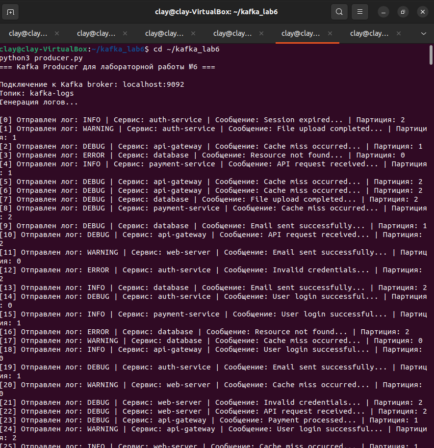

# Отчет по лабораторной работе №6 "Реализация системы обработки логов в реальном времени с использованием Apache Kafka"

## 1. Цель работы
Разработка и настройка системы обработки логов в реальном времени с использованием Apache Kafka, включая создание продюсера для генерации логов и консьюмера для их обработки.

## 2. Используемые технологии
- ***Apache Kafka*** (брокер: localhost:9092)

- ***Python 3*** с библиотекой kafka-python

- ***Топик Kafka***: kafka-logs (3 партиции)

## 3. Архитектура системы
```
┌─────────────────┐     ┌─────────────┐     ┌─────────────────┐
│    Producer     │────▶│   Kafka     │────▶│    Consumer     │
│  (producer.py)  │     │   Broker    │     │  (consumer.py)  │
└─────────────────┘     └─────────────┘     └─────────────────┘
       │                      │                      │
   Генерация логов       Топик: kafka-logs     Обработка логов
                                                 (особенно ERROR)
```
## 4. Реализация компонентов
### 4.1 Producer (producer.py)
**Назначение:** Генерация и отправка логовых сообщений в Kafka.

**Ключевые функции:**
- Подключение к Kafka брокеру
- Генерация логов разных уровней (INFO, WARNING, DEBUG, ERROR)
- Распределение по партициям (0, 1, 2)
- Автоматическое создание топика при необходимости

#### Пример вывода producer:
```
[0] Отправлен лог: INFO | Сервис: auth-service | Сообщение: Session expired... | Партиция: 2
[1] Отправлен лог: WARNING | Сервис: auth-service | Сообщение: File upload completed... | Партиция: 1
...
[18] Отправлен лог: INFO | Сервис: api-gateway | Сообщение: User login successful... | Партиция: 0
```

### 4.2 Consumer (consumer.py)
**Назначение:** Чтение и обработка логов из Kafka.
**Ключевые функции:**
- Подключение к топику kafka-logs
- Использование Consumer Group log-processor-group
- Специальная обработка ERROR-логов
- Вывод структурированной информации

#### Пример вывода consumer:
```
1. Получен лог #3: ERROR | database | Resource not found...
    ВНИМАНИЕ: Обнаружена ошибка в сервисе database
    Сообщение: Resource not found
    Время: 2025-12-26T18:47:29.190610
    IP: 192.168.69.33
```
## 5. Результаты выполнения
### 5.1 Статистика отправленных/полученных сообщений
| Показатель | Количество |
|------------|------------|
| Отправлено логов | 19 |
| Получено логов | 19 |
| ERROR-логов | 3 |
| WARNING-логов | 3 |
| INFO-логов | 5 |
| DEBUG-логов | 8 |

### 5.2 Распределение по партициям
| Партиция | Количество логов |
|----------|------------------|
| 0        | 5 сообщений      |
| 1        | 5 сообщений      |
| 2        | 9 сообщений      |

### 5.3 Распределение по сервисам
| Сервис          | Количество логов |
|-----------------|------------------|
| database        | 6                |
| api-gateway     | 5                |
| auth-service    | 5                |
| payment-service | 3                |
| web-server      | 1                |

## 6. Особенности реализации
### 6.1 Формат логов
**Каждое сообщение имеет структуру:**

```
УРОВЕНЬ_ЛОГА | СЕРВИС | СООБЩЕНИЕ
```
Пример: ***ERROR | database | Resource not found...***

### 6.2 Обработка ERROR-логов
**Consumer автоматически распознает ERROR-логи и выводит расширенную информацию:**
- Сервис, в котором произошла ошибка
- Текст сообщения
- Временная метка
- IP-адрес (генерируется автоматически)

### 6.3 Работа с партициями
**Producer использует случайное распределение по партициям, что обеспечивает:**
- Балансировку нагрузки
- Параллельную обработку
- Отказоустойчивость

### 7.  Визуальное подтверждение работы


📷 *[Скриншот 1: Запуск consumer и ожидание сообщений]*



📷 *[Скриншот 2: Запуск producer и отправка логов]*


## 9. Выводы
1. **Система успешно реализована:** Разработаны producer и consumer для работы с Kafka.

2. **Обработка в реальном времени:** Логи обрабатываются сразу после генерации.

3. **Масштабируемость:** Использование партиций позволяет увеличивать производительность системы.

4. **Надежность:** Kafka гарантирует доставку сообщений даже при временных проблемах.

5. **Гибкость:** Система легко расширяется для обработки новых типов логов.