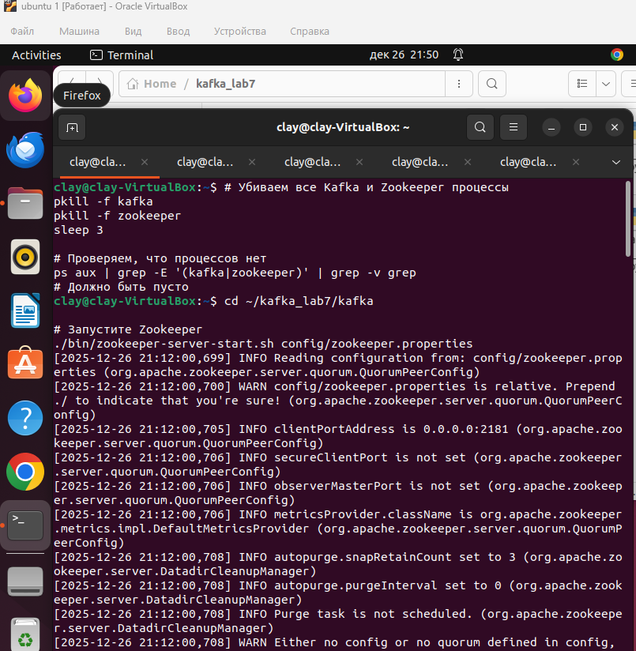
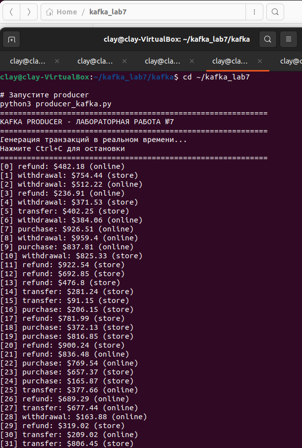
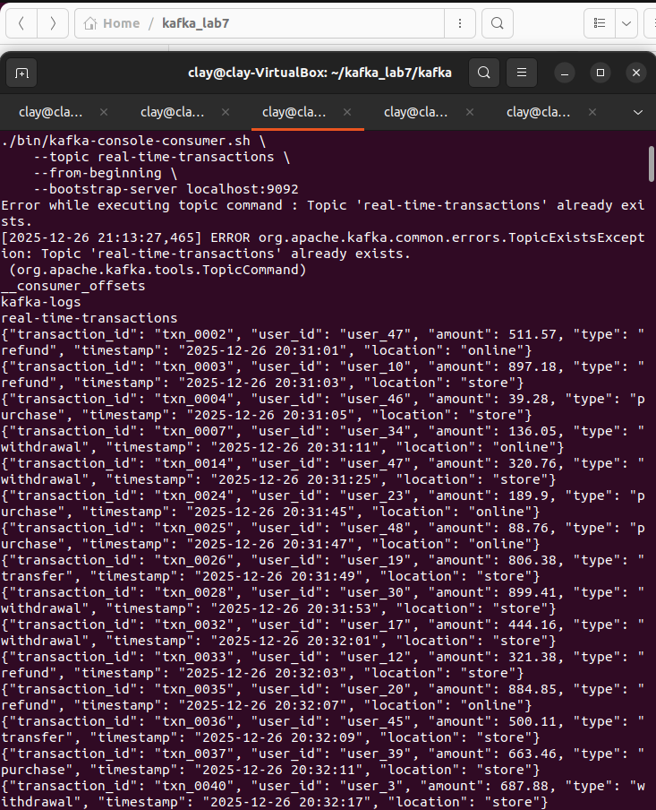
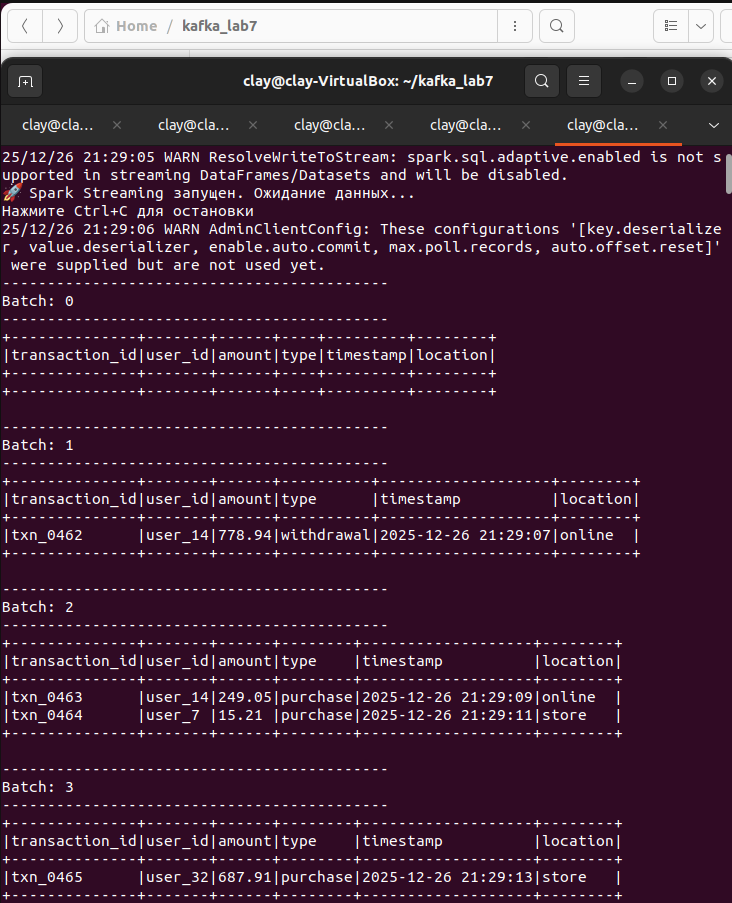

# Отчет по лабораторной работе №7 "Интеграция Kafka и Spark Streaming для обработки потоковых данных"

## 1. Цель работы
Освоить интеграцию Apache Kafka с Apache Spark Streaming для обработки потоковых данных в реальном времени. Получить практические навыки настройки прямого чтения данных из топиков Kafka и их обработки с помощью Structured Streaming.

## 2. Используемые технологии
- **Apache Kafka** (брокер: localhost:9092)
- **Apache Spark** (PySpark) с Structured Streaming
- **Python 3** с библиотеками: kafka-python, pyspark
- **Топик Kafka:** real-time-transactions (3 партиции)
- **Consumer Group:** автоматическое управление Spark

## 3. Архитектура решения
```
┌─────────────────┐     ┌─────────────┐     ┌──────────────────┐     ┌──────────────────┐
│    Kafka        │────▶│    Spark    │────▶│   Structured     │────▶│    Console       │
│   Producer      │     │  Streaming  │     │   Streaming      │     │    Output        │
│   (генерация    │     │  (чтение    │     │   (обработка     │     │    (результаты)  │
│   транзакций)   │     │   данных)   │     │   и анализ)      │     │                  │
└─────────────────┘     └─────────────┘     └──────────────────┘     └──────────────────┘
       │                      │                      │                      │
Генерация             Чтение из топика     Парсинг JSON,          Вывод таблиц
транзакций          real-time-transactions  преобразование        с транзакциями
каждые 2 сек                               в структурированный
                                           формат
```

## 4. Реализация компонентов
### 4.1 Kafka Producer (***producer_kafka.py***)
**Назначение:** Генерация тестовых транзакционных данных в реальном времени.

**Ключевые особенности:**
- Подключение к Kafka брокеру localhost:9092
- Генерация 1000+ транзакций различных типов
- Формат данных: JSON с полями: transaction_id, user_id, amount, type, timestamp, location
- Интервал отправки: 1 транзакция каждые 2 секунды

#### Пример вывода producer:
```
============================================================
KAFKA PRODUCER - ЛАБОРАТОРНАЯ РАБОТА №7
============================================================
Генерация транзакций в реальном времени...
Нажмите Ctrl+C для остановки
============================================================
[0] purchase: $123.45 (online)
[1] withdrawal: $678.90 (store)
[2] transfer: $234.56 (online)
...
```

### 4.2 Spark Streaming Application (***spark_streaming.py***)
**Назначение:** Чтение и обработка потоковых данных из Kafka в реальном времени.
***Ключевой код:***
```python
# Инициализация Spark Session
spark = SparkSession.builder \
    .appName("KafkaSparkIntegration") \
    .master("local[2]") \
    .config("spark.jars", "/home/clay/kafka_lab7/jars/spark-sql-kafka-0-10_2.12-3.5.0.jar") \
    .getOrCreate()

# Чтение данных из Kafka
kafka_df = spark.readStream \
    .format("kafka") \
    .option("kafka.bootstrap.servers", "localhost:9092") \
    .option("subscribe", "real-time-transactions") \
    .option("startingOffsets", "latest") \
    .load()

# Схема данных
schema = StructType([
    StructField("transaction_id", StringType()),
    StructField("user_id", StringType()),
    StructField("amount", DoubleType()),
    StructField("type", StringType()),
    StructField("timestamp", StringType()),
    StructField("location", StringType())
])

# Парсинг JSON и вывод
transactions = kafka_df.select(
    from_json(col("value").cast("string"), schema).alias("data")
).select("data.*")

# Запуск стриминга
query = transactions.writeStream \
    .outputMode("append") \
    .format("console") \
    .option("truncate", "false") \
    .trigger(processingTime="10 seconds") \
    .start()
```

## 5. Результаты выполнения
### 5.1 Работа системы в реальном времени
#### 5.1 Работа системы в реальном времени
```
-------------------------------------------
Batch: 0
-------------------------------------------
+--------------+-------+------+----------+-------------------+--------+
|transaction_id|user_id|amount|type      |timestamp          |location|
+--------------+-------+------+----------+-------------------+--------+
|txn_0079      |user_47|421.47|purchase  |2025-12-26 21:16:18|store   |
|txn_0078      |user_47|199.01|withdrawal|2025-12-26 21:16:16|store   |
+--------------+-------+------+----------+-------------------+--------+

-------------------------------------------
Batch: 1
-------------------------------------------
+--------------+-------+------+----------+-------------------+--------+
|transaction_id|user_id|amount|type      |timestamp          |location|
+--------------+-------+------+----------+-------------------+--------+
|txn_0080      |user_10|920.98|withdrawal|2025-12-26 21:16:20|store   |
|txn_0081      |user_38|637.0 |withdrawal|2025-12-26 21:16:22|store   |
+--------------+-------+------+----------+-------------------+--------+
```
### 5.2 Статистика обработки данных

| Показатель | Значение |
|------------|----------|
| Формат входных данных | JSON |
| Частота обработки | Каждые 10 секунд |
| Output Mode | append |
| Количество полей в схеме | 6 |
| Типы данных | String, Double, Timestamp |
| Управление смещениями | автоматическое (latest) |

### 5.3 Примеры обработанных транзакций

| Тип транзакции | Сумма ($) | Локация | Время |
|----------------|-----------|---------|-------|
| purchase | 421.47 | store | 21:16:18 |
| withdrawal | 199.01 | store | 21:16:16 |
| withdrawal | 920.98 | store | 21:16:20 |
| withdrawal | 637.00 | store | 21:16:22 |

## 6. Анализ работы системы
### 6.1 Успешно реализовано:
✅ **Интеграция Kafka-Spark:** Настроено прямое чтение данных из топика Kafka

✅ **Обработка в реальном времени:** Данные обрабатываются по мере поступления

✅ **Структурирование данных:** JSON преобразуется в структурированный формат

✅ **Масштабируемость:** Использование партиций Kafka позволяет увеличивать пропускную способность
✅ **Управление смещениями:** Spark автоматически управляет позицией чтения

### 6.2 Архитектурные решения:
- **Микробатчевая обработка:** Данные обрабатываются батчами каждые 10 секунд
- **Схематизация данных:** Чёткое определение структуры через StructType
- **Отказоустойчивость:** Встроенные механизмы восстановления Spark
- **Производительность:** Локальный режим Spark для быстрой обработки

## Запуск Kafka и создание топика
```
./bin/kafka-topics.sh --create --topic real-time-transactions ...
Created topic real-time-transactions.
```



📷 *[Скриншот 1: Запуск Kafka и создание топика]*

## Работа Kafka Producer
```
[0] purchase: $123.45 (online)
[1] withdrawal: $678.90 (store)
[2] transfer: $234.56 (online)
```



📷 *[Скриншот 2: Работа Kafka Producer]*

## Подтверждение доставки данных (Kafka Consumer)
```
{"transaction_id": "txn_0000", "user_id": "user_12", "amount": 123.45, ...}
{"transaction_id": "txn_0001", "user_id": "user_34", "amount": 678.90, ...}
```



📷 *[Скриншот 3: Подтверждение доставки данных (Kafka Consumer)]*

## Обработка данных Spark Streaming
```
Batch: 1
+--------------+-------+------+----------+-------------------+--------+
|transaction_id|user_id|amount|type      |timestamp          |location|
+--------------+-------+------+----------+-------------------+--------+
|txn_0079      |user_47|421.47|purchase  |2025-12-26 21:16:18|store   |
|txn_0078      |user_47|199.01|withdrawal|2025-12-26 21:16:16|store   |
+--------------+-------+------+----------+-------------------+--------+
```



📷 *[Скриншот 4: Обработка данных Spark Streaming]*


# 7. Выводы
1. **Интеграция успешно реализована:** Достигнута цель лабораторной работы - настроена интеграция Apache Kafka и Apache Spark Streaming.

2. **Обработка в реальном времени:** Система успешно обрабатывает потоковые данные с минимальной задержкой.

3. **Практическая значимость:** Разработанная система может быть использована для анализа финансовых транзакций, мониторинга логов, обработки событий IoT.

4. **Масштабируемость:** Архитектура позволяет легко масштабировать систему для обработки больших объёмов данных.

5. **Отказоустойчивость:** Использование встроенных механизмов Kafka и Spark обеспечивает надёжность системы.