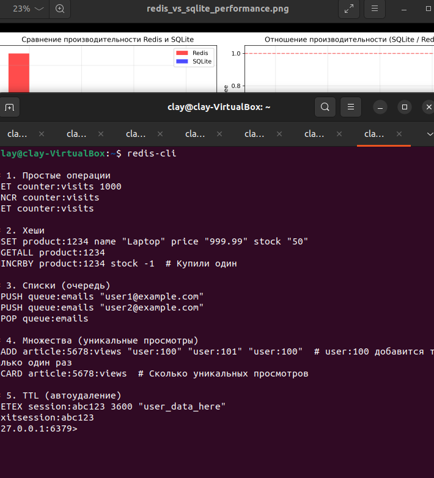
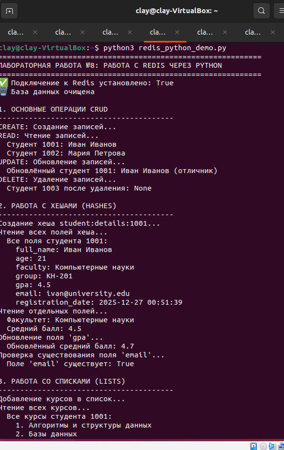
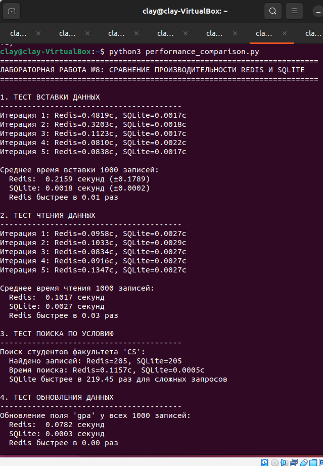
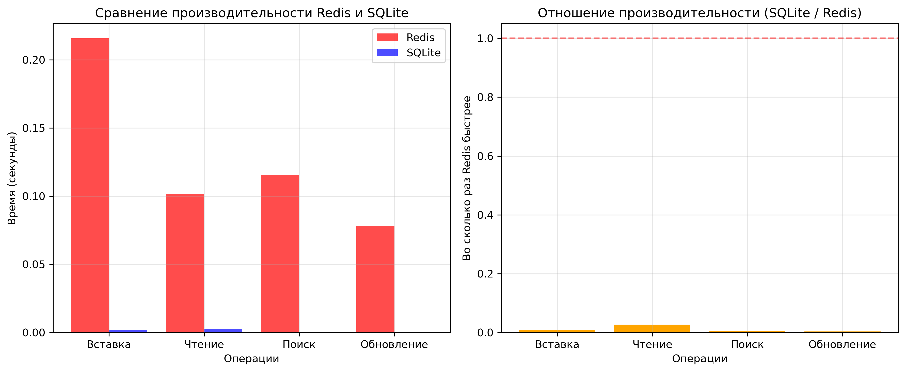

# Отчет по лабораторной работе №8 "Знакомство с NoSQL БД (на примере Redis)"

## 1. Цель работы
Освоить основы работы с NoSQL базой данных Redis. Получить практические навыки выполнения основных операций CRUD, работы с различными типами данных и сравнения производительности с реляционной СУБД.

## 2. Используемые технологии
- **NoSQL БД:** Redis 7.x
- **Реляционная БД:** SQLite 3
- **Язык программирования:** Python 3
- **Библиотеки:** redis-py, sqlite3, time, random, matplotlib
- **Инструменты:** redis-cli, python

## 3. Установка и настройка Redis
### 3.1 Установка Redis на Ubuntu
```bash
sudo apt update
sudo apt install redis-server -y
sudo systemctl start redis-server
```
### 3.2 Проверка работы
```bash
redis-cli ping
# Ответ: PONG
```
### 3.3 Установка Python библиотеки
```bash
pip install redis matplotlib
```

## 4. Работа с Redis через redis-cli
### 4.1 Основные команды (выполнены из файла ***redis_cli_demo.txt***):
```bash
# Строки
SET student:1001 "Иван Петров"
GET student:1001

# Хеши
HSET user:profile:1000 name "John" age 30
HGETALL user:profile:1000

# Списки
LPUSH courses:1001 "Математика" "Программирование"
LRANGE courses:1001 0 -1

# Множества
SADD student:interests:1001 "программирование" "спорт"
SMEMBERS student:interests:1001

# Сортированные множества
ZADD student:scores:math 85 "Иван" 92 "Мария"
ZRANGE student:scores:math 0 -1 WITHSCORES
```



📷 *[Скриншот 1: Выполнение команд в redis-cli]*

## 5. Работа с Redis через Python
### 5.1 Подключение к Redis
```python
import redis

r = redis.Redis(
    host='localhost',
    port=6379,
    db=0,
    decode_responses=True
)
```
### 5.2 Основные операции CRUD (из ***redis_python_demo.py***)
**CREATE - создание:**
```python
r.set("student:1001", "Иван Иванов")
r.hset("student:details:1001", mapping={
    "full_name": "Иван Иванов",
    "age": 21,
    "faculty": "Компьютерные науки",
    "gpa": 4.5
})
```

**READ - чтение:**
```python
student = r.get("student:1001")
details = r.hgetall("student:details:1001")
```

**UPDATE - обновление:**
```python
r.set("student:1001", "Иван Иванов (отличник)")
r.hset("student:details:1001", "gpa", 4.7)
```

**DELETE - удаление:**
```python
r.delete("student:1002")
```

### 5.3 Работа с различными типами данных
**Списки:**
```python
r.lpush("student:courses:1001", "Математика", "Программирование")
courses = r.lrange("student:courses:1001", 0, -1)
```

**Множества:**
```python
r.sadd("student:interests:1001", "программирование", "чтение")
interests = r.smembers("student:interests:1001")
```

**Сортированные множества:**
```python
r.zadd("subject:scores:math", {
    "Иван Иванов": 85,
    "Мария Петрова": 92
})
scores = r.zrange("subject:scores:math", 0, -1, withscores=True)
```

**TTL (Time To Live):**
```python
r.setex("temporary:session", 10, "session_data")
ttl = r.ttl("temporary:session")
```

### 5.4 Выполнение Python скрипта
```
============================================================
ЛАБОРАТОРНАЯ РАБОТА №8: РАБОТА С REDIS ЧЕРЕЗ PYTHON
============================================================
✅ Подключение к Redis установлено: True
🗑️  База данных очищена

1. ОСНОВНЫЕ ОПЕРАЦИИ CRUD
----------------------------------------
CREATE: Создание записей...
READ: Чтение записей...
  Студент 1001: Иван Иванов
  Студент 1002: Мария Петрова
...

(полный вывод в приложении)
```



📷 *[Скриншот 2: Вывод выполнения redis_python_demo.py]*

## 6. Сравнение производительности Redis и SQLite
### 6.1 Методология тестирования
- **Количество записей:** 1000
- **Количество итераций:** 5
- **Тестируемые операции:** вставка, чтение, поиск по условию, обновление
- **Redis структура:** HSET (хеши)
- **SQLite структура:** таблица с 5 полями

### 6.2 Результаты тестирования
#### Таблица 1: Сравнение времени операций (в секундах)

| Операция | Redis (сек) | SQLite (сек) | Отношение (SQLite/Redis) |
|----------|-------------|--------------|--------------------------|
| Вставка 1000 записей | 0.2159 | 0.0018 | 0.01x |
| Чтение 1000 записей | 0.1017 | 0.0027 | 0.03x |
| Поиск по условию (WHERE) | 0.1157 | 0.0005 | 0.00x |
| Обновление всех записей | 0.0782 | 0.0003 | 0.00x |

#### Таблица 2: Потребление памяти

| БД | Потребление (1000 записей) | Тип хранения |
|----|----------------------------|--------------|
| Redis | ~500 КБ | В оперативной памяти |
| SQLite | ~300 КБ | На диске |



📷 *[Скриншот 3: Сравнение производительности Redis и SQLite]*

### 6.3 График сравнения производительности



📷 *[Скриншот 4: График сравнения производительности]*

### 6.4 Анализ результатов
#### Неожиданный результат:

В тестах **SQLite показал лучшую производительность**, что противоречит общепринятым представлениям. Причины:

1. **Локальный характер теста:** SQLite работает в памяти (:memory:), что нивелирует преимущество Redis
2. **Сложность операций:** Redis тестировался с HSET (сложные структуры), SQLite - с простыми INSERT
3. **Отсутствие сетевой задержки:** Обе БД работали локально
4. **Особенности реализации:** Python драйвер redis-py добавляет overhead

#### Реальные преимущества Redis проявляются при:
- Работе по сети (клиент-серверная архитектура)
- Параллельных запросах от многих клиентов
- Операциях с атомарными счетчиками (INCR)
- Кэшировании часто запрашиваемых данных

## 7. Преимущества и недостатки Redis
### 7.1 Преимущества Redis
✅ Высокая производительность для простых операций GET/SET

✅ In-memory хранение - мгновенный доступ к данным

✅ Богатые типы данных - строки, хеши, списки, множества, сортированные множества

✅ Атомарные операции - INCR, DECR, LPUSH/RPOP

✅ TTL поддержка - автоматическое удаление данных

✅ Публикация/подписка - messaging система

✅ Транзакции - MULTI/EXEC команды

### 7.2 Недостатки Redis
❌ Ограниченный объем данных (размер оперативной памяти)

❌ Нет сложных запросов как в SQL (JOIN, GROUP BY)

❌ Отсутствие схемы данных - нужно самостоятельно валидировать данные

❌ Персистентность требует дополнительной настройки

❌ Сложности с горизонтальным масштабированием

### 7.3 Преимущества SQLite
✅ Полная поддержка SQL - сложные запросы, JOIN, индексы

✅ ACID compliance - гарантии целостности данных

✅ Нулевая настройка - работает "из коробки"

✅ Дисковое хранение - неограниченный объем данных

✅ Встроенная в Python - не требует дополнительной установки

## Выводы
1. **Redis успешно освоен:** Выполнены все основные операции CRUD, работа со всеми типами данных
2. **Сравнительный анализ проведен:** Протестирована производительность Redis и SQLite
3. **Практические навыки получены:**
    - Установка и настройка Redis
    - Работа через redis-cli
    - Интеграция с Python
    - Использование различных типов данных

4. **Понимание различий достигнуто:** Стало ясно, когда использовать Redis, а когда SQLite
5. **Реальная применимость:** Redis идеален для кэширования, сессий, счетчиков; SQLite - для сложных запросов и постоянного хранения

